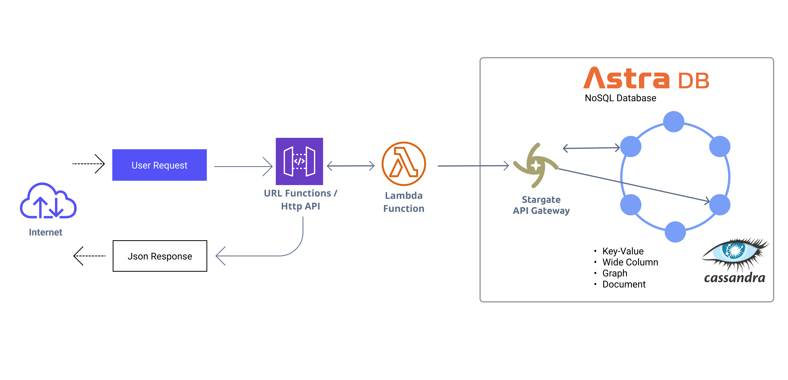
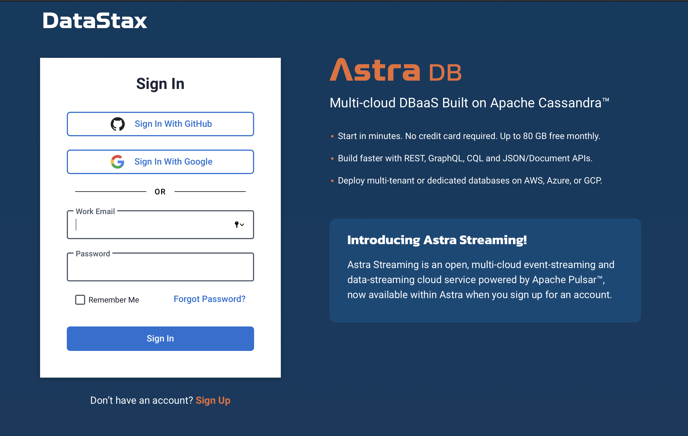

<!--- STARTEXCLUDE --->
# How to create Serveless backend with Astra DB, Lambda & Node.js Deployed by AWS CDK
*30 minutes, Intermediate, [Start Building](https://github.com/DataStax-Examples/google-cloud-functions-nodejs#prerequisites)*

 facilitate the setup and deployment of the functions.

## Reduce development time & turn up speed with Astra DB

Today software development going at a faster pace than ever. To keep up with the trends, meet customer demands, and not fall behind in the competitive market, developers have to work hard to produce good pieces of code with quality within tight deadlines.

There are many ways organizations try to achieve improved development velocity, for example, Adding more developers, reviewing technical requirements, etc, to start with the high level and break it down. Software is all about breaking programs and clarifying the details.

Developers need to create frontend web, backend, and mobile apps quickly and easily and no need to wait for another team to deliver a service to consume data

## What is [Astra DB](https://astradb.datastax.com)

[Astra DB](https://astradb.datastax.com) is a Serverless Database based on Apache Cassandra, as a managed service, it gives you all of the benefits of Cassandra without the cost of self-managed operations, with [Astra DB](https://astradb.datastax.com) you can create apps faster and reduce deployment time from weeks to minutes. With autoscaling, invisible ops and pay-as-you-go pricing, [Astra DB](https://astradb.datastax.com) accelerates cloud functions end to end—from function to database—and handles structured and unstructured data to enjoy the freedom of multi-cloud and open source.


This example shows how to use [AWS Lambda](https://aws.amazon.com/lambda/) with the [Node.js DataStax Cassandra Driver](https://docs.datastax.com/en/developer/nodejs-driver/latest) to set up a basic REST API for a Cassandra database via HTTP Endpoints. The [AWS CDK](https://serverless.com/) is used to
<!--- ENDEXCLUDE --->

  
## How it works
Infrastructure as Code help to develoment team to accelerate your time to done and allow you to create complex architectures and share reference architectures and solution implementations with your teammates, across lines of business. 

The AWS CDK handles the packaging and deployment of the functions to AWS Lambda. Once the functions are deployed, the DataStax Cassandra Driver establishes the connection to the database and returns the results via the AWS Lambda URL Functions by HTTP Endpoints which can be accessed to interact with the database.


## Getting Started

## Architecture

We are going to based on following architecture



<!--- STARTEXCLUDE --->
## Prerequisites

Have an active AWS Account, with privileges

* AWS CLI
* AWS Account and User
* Node.js
* IDE for your programming language

For a detailed walkthrough, see the [tutorial](https://docs.aws.amazon.com/cdk/latest/guide/getting_started.html#hello_world_tutorial) in the AWS CDK [Developer Guide](https://docs.aws.amazon.com/cdk/latest/guide/home.html).

### Set up your environment for CDK

Install or update the [AWS CDK CLI] from npm (requires [Node.js ≥ 14.15.0](https://nodejs.org/download/release/latest-v14.x/)). We recommend using a version in [Active LTS](https://nodejs.org/en/about/releases/)


Let's create a serverless [Database](https://awesome-astra.github.io/docs/pages/astra/create-instance)


### DataStax Astra
1. Create a [DataStax Astra account](https://dtsx.io/38HWu73) if you don't already have one:


2. On the home page. Locate the button **`Create Database`**


3. Locate the **`Get Started`** button to continue


4. Define a **database name**, **keyspace name** and select a database **region**, then click **create database**.


5. Your Astra DB will be ready when the status will change from *`Pending`* to **`Active`** 💥💥💥 


6. After your database is provisioned, we need to generate an Application Token for our App. Go to the `Settings` tab in the database home screen.


7. Select `Admin User` for the role for this Sample App and then generate the token. Download the CSV so that we can use the credentials we need later.


8. After you have your Application Token, head to the database connect screen and select the driver connection that we need. Go ahead and download the `Secure Bundle` for the driver.


9. Make note of where to use the `Client Id` and `Client Secret` that is part of the Application Token that we generated earlier.


Once the above is completed, you will have all of the needed pieces in place to run this example.

## Using the Document API to connect to your database
The Document API allows you to store JSON documents in Astra DB without a schema.


## Set up your development environment

* 1. Install the Astra DB JS Collection:

```console
npm i @astrajs/collections
```

An Application Token (create a new one here) with the appropriate role set (API Admin User is needed for example below).

In the command-line interface associated with your development environment, paste the following and replace <app_token> with your Application Token:
```sh
export ASTRA_DB_ID=<YOUR_ASTRADB_ID>
export ASTRA_DB_REGION=<REGION_ASTRADB>
export ASTRA_DB_KEYSPACE=<KEYSAPCE>
export ASTRA_DB_APPLICATION_TOKEN=<APP_TOKEN>
```
Use printenv to ensure the environment variables were exported or check individually by echo.

```sh

  printenv
  
  echo $ASTRA_DB_ID

```
```console

npm i -g aws-cdk

```

Initialize a project:

```console
mkdir hello-cdk
cd hello-cdk
cdk init sample-app --language=typescript
```

Our CDK code looking like this:

```ts

import { Stack, StackProps, Duration, RemovalPolicy } from 'aws-cdk-lib';
import { Construct } from 'constructs';
import { NodejsFunction } from 'aws-cdk-lib/aws-lambda-nodejs';
import { RetentionDays } from 'aws-cdk-lib/aws-logs';
import { join } from 'path';
import {
  Code,
  Function,
  FunctionUrlAuthType,
  HttpMethod,
  Runtime,
} from 'aws-cdk-lib/aws-lambda';

export class AstradbServerlessCrudStack extends Stack {
  constructor(scope: Construct, id: string, props?: StackProps) {
    super(scope, id, props);

    const webhook_function = new NodejsFunction(this, 'get-data-service', {
      environment: {
        ASTRA_DB_ID: "<YOUR_ASTRADB_ID>",
        ASTRA_DB_REGION: "<REGION_ASTRADB>",
        ASTRA_DB_KEYSPACE: "<KEYSAPCE>",
        ASTRA_DB_APPLICATION_TOKEN: "<APP_TOKEN>",
      },
      entry: join(__dirname, "lambda", "index.ts"),
      runtime: Runtime.NODEJS_16_X,
      logRetention: RetentionDays.ONE_WEEK,
      currentVersionOptions: {
        removalPolicy: RemovalPolicy.DESTROY,
      }, 
    });

    webhook_function.addFunctionUrl({
      authType: FunctionUrlAuthType.NONE,
      cors: {
          allowedMethods: [HttpMethod.GET, HttpMethod.POST],
          allowedOrigins: ['*'],
          maxAge: Duration.minutes(1),
      },

    });
  }
}
```

Next, we are going to implement a simple lambda that saves and then retrieves an order. 

```ts
const { createClient } = require("@astrajs/collections");

export const handler = async (event: any = {}): Promise<any> => {
    
    let search = "all";

    let method = event?.queryStringParameters?.httpMethod;
    let field = event?.queryStringParameters?.field;
    search = event.queryStringParameters?.search;
    let colletion = event?.queryStringParameters?.collection;

    const astraClient = await createClient(
            {
            astraDatabaseId: process.env.ASTRA_DB_ID,
            astraDatabaseRegion: process.env.ASTRA_DB_REGION,
            applicationToken: process.env.ASTRA_DB_APPLICATION_TOKEN,
            },
        );

    const astradbClient = astraClient.namespace(process.env.ASTRA_DB_KEYSPACE).collection(colletion);

    if(method == "GET"){
            if(search=="all"){
                try {
                    const res = await astradbClient.find({});
                    const todo = Object.keys(res).map((item) => res[item]);
                
                    return {
                    statusCode: 200,
                    body: JSON.stringify(todo),
                    };
                } catch (e) {
                    return {
                    statusCode: 400,
                    body: JSON.stringify(e),
                    };
                }
            }else{
                try {
                    
                    const todoResult = await astradbClient.get(search);
                    const todo = Object.keys(todoResult).map((item) => todoResult[item]);
                    return {
                    statusCode: 200,
                    body: JSON.stringify(todo),
                    };
                } catch (e) {
                    console.log(e)
                    return {
                    statusCode: 400,
                    body: JSON.stringify(e),
                    };
                }
            }
        
        }

    if(method == "POST"){
        const body = JSON.parse(event.body);

        try {
            const email = body?.email;
            delete body.email;
            const result = await astradbClient.create(email,body);
            
            return {
                statusCode: 200,
                body: result.documentId,
            };
        } catch (e) {
            console.log(e)
            return {
                statusCode: 400,
                body: JSON.stringify(e),
            };
        }
    }

    if(method == "PUT"){
        const body = JSON.parse(event.body);

        try {
            const email = body?.email;
            const result = await astradbClient.update(email, body);
            return {
                statusCode: 200,
                body: JSON.stringify(result.documentId),
            };
        } catch (e) {
                console.log(e)
                return {
                    statusCode: 400,
                    body: JSON.stringify(e),
                };
        }
    }

}

```
Deploy this to your account:

```console
cdk deploy
```

Use the `cdk` command-line toolkit to interact with your project:

 * `cdk deploy`: deploys your app into an AWS account
 * `cdk synth`: synthesizes an AWS CloudFormation template for your app
 * `cdk diff`: compares your app with the deployed stack


#### createCatalog
```sh

### Get All Todos

GET https://rvxw33nmevze22chnhwloteb4y0phlqa.lambda-url.us-east-1.on.aws/
Content-Type: application/json
Accept: application/json

````
expected output:
```sh

```

#### Insert Todo
Note the `-H "Content-Type:application/json"` is required here.
```sh
### Insert Data
POST https://rvxw33nmevze22chnhwloteb4y0phlqa.lambda-url.us-east-1.on.aws/
Content-Type: application/json
Accept: application/json

{                          
    "todo_id" : "123",
    "todo_title" : "2022-07-01",
    "todo_description" : " Hola Demo "
}

```
expected output:
```sh

```
#### Update Todo
```sh
### Insert Data
POST https://rvxw33nmevze22chnhwloteb4y0phlqa.lambda-url.us-east-1.on.aws/
Content-Type: application/json
Accept: application/json

{                          
    "todo_id" : "123",
    "todo_description" : " Updated Todo "
}

```
expected output:
```sh

```

<!--- ENDEXCLUDE --->

With this test we conclude the code, we implemented an AstraClient that uses the Astra DB Document API to store and retrieve Todos. Then we tested our code using a custom CURL request to test our API.

Happy coding with serverless API and Serveless Database into production!


